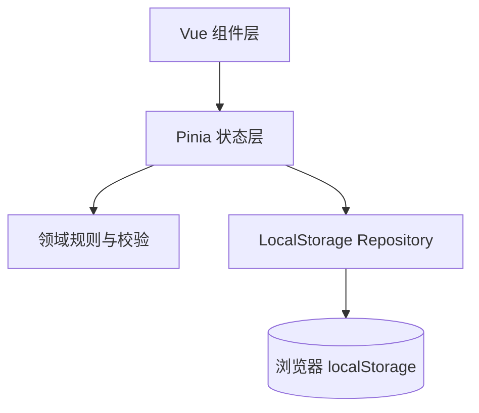
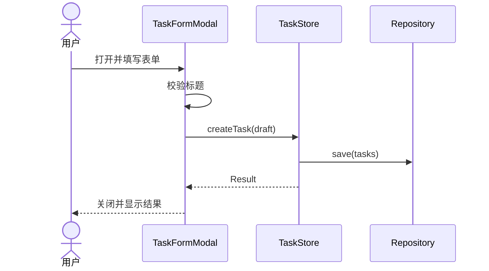

# 任务管理应用架构设计

版本：1.0  
目标读者：负责实现与验收的 Code Agent  
技术基线：Vue 3、Vite、Tailwind CSS、localStorage

## 1. 文档目的

本文将课堂实践中的产品要求转化为可直接实现的前端架构。实现范围是一款无需登录、无需后端的单用户任务管理应用。应用支持任务增删改查、三状态看板、三档优先级、拖拽改状态、深色模式和浏览器本地持久化。

本文同时定义模块边界、数据模型、状态流、存储协议、目录结构、测试策略和验收标准。Code Agent 应以本文为实现契约；未列入 MVP 的能力不得自行扩展。

## 2. 需求基线

### 2.1 功能需求

| 编号 | 需求 | 验收要点 |
|---|---|---|
| FR-01 | 新建任务 | 标题必填；描述选填；可指定状态与优先级 |
| FR-02 | 查看任务 | 在三列看板中显示任务卡片 |
| FR-03 | 编辑任务 | 可修改标题、描述、状态和优先级 |
| FR-04 | 删除任务 | 用户确认后删除；刷新后不恢复 |
| FR-05 | 状态管理 | 状态固定为待办、进行中、完成 |
| FR-06 | 优先级 | 高、中、低分别使用红、黄、绿作为视觉提示，同时显示文字 |
| FR-07 | 看板拖拽 | 卡片跨列拖拽后立即更新状态并持久化 |
| FR-08 | 深色模式 | 一键切换；刷新或重新打开页面后保留选择 |
| FR-09 | 本地持久化 | 任务存入 localStorage；刷新页面数据不丢失 |

### 2.2 非功能需求

- 桌面端优先，同时保证窄屏可用；窄屏下三列可纵向排列或横向滚动。
- 常规交互应即时反馈，不依赖网络。
- 颜色不能作为状态或优先级的唯一表达方式。
- 数据损坏时应用应恢复为安全空状态，不得白屏。
- 关键业务逻辑应通过单元测试；核心用户路径应通过组件或端到端测试。

### 2.3 MVP 非目标

- 用户注册、登录、权限与多用户协作。
- 后端 API、数据库、云同步与跨设备同步。
- 截止日期、标签、子任务、搜索、筛选、排序和通知。
- 服务端渲染、离线 Service Worker、实时通信。

如需增加上述能力，应先修改需求和数据模型，不能在本轮实现中默认加入。

## 3. 总体架构

采用单页应用和分层组合式架构。组件层负责展示与交互；状态层集中维护任务和主题；领域层承载校验与状态转换；基础设施层封装 localStorage。任何 Vue 组件都不应直接读写 localStorage。



推荐依赖：

- Vue 3 + TypeScript，使用 Composition API 和 `<script setup>`。
- Vite 负责开发、构建和测试环境。
- Tailwind CSS 负责样式与 dark variant。
- Pinia 负责集中状态管理。若课堂环境要求最少依赖，可用 composable 替代，但必须保持相同的接口边界。
- `@vueuse/core` 可选；不应仅为一个 localStorage 功能引入。
- 拖拽优先使用原生 HTML5 Drag and Drop，避免为简单跨列移动引入大型依赖。若需要触屏拖拽，再评估 Vue Draggable。
- Vitest + Vue Test Utils 负责单元与组件测试；Playwright 可选，用于核心流程端到端测试。

## 4. 核心设计决策

### 4.1 单一事实源

运行期间，`taskStore.tasks` 是任务数据的唯一事实源。看板列通过 getter/computed 按状态派生，不保存三份独立数组，从而避免同一任务在多个列中重复或丢失。

### 4.2 写入策略

每个成功的业务操作遵循以下顺序：校验输入、更新内存状态、序列化并写入 localStorage、更新界面。若持久化失败，Store 返回结构化错误并显示非阻塞提示；内存状态可继续使用，但应提示用户刷新可能丢失变更。

### 4.3 ID 与时间

- 任务 ID 使用 `crypto.randomUUID()`；不支持时回退到时间戳加随机串。
- `createdAt` 和 `updatedAt` 使用 ISO 8601 UTC 字符串。
- 所有更新时间由 Store action 统一设置，组件不得自行修改。

### 4.4 删除确认

删除是不可恢复操作，必须二次确认。MVP 可使用确认对话框组件；不建议直接使用 `window.confirm`，因为难以统一样式和测试。

### 4.5 拖拽语义

拖拽只改变任务的 `status`，不在 MVP 内维护列内排序。放入原状态列属于幂等操作，不更新 `updatedAt`。拖拽期间应突出有效投放区域，并支持取消。

## 5. 数据模型与存储协议

### 5.1 TypeScript 类型

```ts
export type TaskStatus = 'todo' | 'in_progress' | 'done'
export type TaskPriority = 'high' | 'medium' | 'low'

export interface Task {
  id: string
  title: string
  description: string
  status: TaskStatus
  priority: TaskPriority
  createdAt: string
  updatedAt: string
}

export interface TaskDraft {
  title: string
  description?: string
  status?: TaskStatus
  priority?: TaskPriority
}

export interface PersistedTaskStateV1 {
  version: 1
  tasks: Task[]
}

export type ThemePreference = 'light' | 'dark'
```

### 5.2 字段约束

| 字段 | 规则 |
|---|---|
| `id` | 非空、唯一、创建后不可修改 |
| `title` | `trim()` 后长度 1 至 100；保存时保留内部空格 |
| `description` | 可空；建议限制在 1000 字符以内 |
| `status` | 只能取 `todo`、`in_progress`、`done` |
| `priority` | 只能取 `high`、`medium`、`low` |
| `createdAt` | 合法 ISO 时间；创建后不可修改 |
| `updatedAt` | 合法 ISO 时间；实际字段变化时更新 |

默认值：`description = ''`、`status = 'todo'`、`priority = 'medium'`。

### 5.3 localStorage 键

| Key | Value | 说明 |
|---|---|---|
| `task-manager.tasks` | `PersistedTaskStateV1` JSON | 任务数据，包含 schema version |
| `task-manager.theme` | `light` 或 `dark` | 用户主题选择 |

严禁把 `undefined`、Vue Proxy、函数或组件状态写入存储。

### 5.4 读取与容错

应用启动时：

1. 读取 `task-manager.tasks`。
2. Key 不存在时返回空任务数组。
3. JSON 解析失败、版本未知或结构校验失败时，将原始值备份到 `task-manager.tasks.corrupt.<timestamp>`，随后使用空数组，并向用户提示本地数据无法读取。
4. 读取主题；缺失时可按 `prefers-color-scheme` 初始化，但一旦用户手动选择就以已保存值为准。

Repository 接口：

```ts
export interface TaskRepository {
  load(): Task[]
  save(tasks: Task[]): void
  clear(): void
}
```

## 6. 状态管理

### 6.1 Task Store

状态：

```ts
interface TaskStoreState {
  tasks: Task[]
  initialized: boolean
  storageError: string | null
}
```

Getter：

- `tasksByStatus(status)`：返回指定状态的任务。
- `taskCounts`：返回三种状态的数量。
- `getTaskById(id)`：用于编辑和删除。

Action：

| Action | 输入 | 行为 |
|---|---|---|
| `initialize()` | 无 | 从 Repository 加载一次 |
| `createTask(draft)` | `TaskDraft` | 校验、补默认值、生成 ID 和时间、持久化 |
| `updateTask(id, patch)` | ID + 可编辑字段 | 校验、合并、更新时间、持久化 |
| `deleteTask(id)` | ID | 删除存在的任务并持久化 |
| `moveTask(id, status)` | ID + 目标状态 | 状态变化时更新并持久化 |
| `clearStorageError()` | 无 | 清除已展示的错误 |

Action 对不存在的 ID 必须返回失败结果，不得静默创建。

### 6.2 Theme Store

状态只包含 `preference`。`toggleTheme()` 更新状态、写入 `task-manager.theme`，并同步在根元素 `<html>` 上增删 `dark` class。主题初始化必须在应用挂载前执行，以减少首屏闪烁。

### 6.3 结果与错误

业务 action 推荐返回：

```ts
type Result<T = void> =
  | { ok: true; value: T }
  | { ok: false; code: 'VALIDATION' | 'NOT_FOUND' | 'STORAGE'; message: string }
```

组件基于结果显示字段错误或 Toast，不通过捕获任意异常来推断业务失败。

## 7. 组件架构

| 组件 | 职责 | 关键输入/输出 |
|---|---|---|
| `AppShell.vue` | 页面框架、标题、主题切换、全局 Toast | 无业务数据写入 |
| `KanbanBoard.vue` | 渲染三列、协调拖拽 | 从 Store 获取派生列 |
| `KanbanColumn.vue` | 单一状态列、计数、投放区域 | `status`, `title`, `tasks`; emit `drop-task` |
| `TaskCard.vue` | 展示标题、描述摘要、优先级、操作入口 | `task`; emit `edit`, `delete`, `drag-start` |
| `TaskFormModal.vue` | 新建/编辑表单及校验信息 | `mode`, `initialTask`; emit `submit`, `close` |
| `ConfirmDialog.vue` | 删除二次确认 | `open`, `title`, `message`; emit `confirm`, `cancel` |
| `ThemeToggle.vue` | 主题切换按钮 | 读取 Theme Store |
| `ToastRegion.vue` | 可访问的成功/错误通知 | 通知队列 |
| `EmptyColumnState.vue` | 空列提示和投放指示 | `status` |

容器组件负责访问 Store，展示组件通过 props 和 emits 通信。`TaskCard` 不直接删除或更新 Store，以便独立测试和复用。

## 8. 页面与交互流程

### 8.1 新建任务



- 空标题提交时停留在表单，并将焦点移到标题输入框。
- 创建成功后关闭弹窗，新卡片立即出现在目标列。
- 保存失败时保留输入内容并显示错误。

### 8.2 编辑任务

打开表单时复制任务数据到本地表单状态，避免用户取消编辑时污染 Store。提交后调用 `updateTask`。如果所有字段均未改变，应直接关闭且不更新时间。

### 8.3 删除任务

点击删除后打开确认框；确认后调用 `deleteTask`。取消时不改变任何状态。删除不存在的任务返回 `NOT_FOUND` 并刷新当前视图。

### 8.4 拖拽改状态

1. `dragstart` 把任务 ID 写入 `dataTransfer`，并记录当前拖拽 ID。
2. 列的 `dragover` 调用 `preventDefault()` 并显示高亮。
3. `drop` 读取 ID，调用 `moveTask(id, column.status)`。
4. `dragend` 清理拖拽 UI 状态。

为兼顾键盘用户，每张卡片还应提供“移动到”菜单或编辑表单中的状态选择，确保拖拽不是唯一操作路径。

## 9. 视觉与可访问性

- 三列标题使用“待办”“进行中”“完成”，并显示任务数量。
- 优先级映射：高为红色、中为黄色、低为绿色；同时显示“高/中/低”文字徽标。
- 卡片必须有可见焦点样式；按钮提供可辨识文字或 `aria-label`。
- 弹窗打开后聚焦首个输入；Tab 焦点限制在弹窗内；Escape 关闭非提交状态的弹窗；关闭后焦点回到触发按钮。
- Toast 使用合适的 `aria-live` 区域。错误通知用 assertive，普通成功信息用 polite。
- 深色模式下正文、边框、背景和优先级徽标需保持足够对比度。
- 尊重 `prefers-reduced-motion`，减少非必要过渡动画。

## 10. 推荐目录结构

```text
task-manager/
├── src/
│   ├── components/
│   │   ├── board/KanbanBoard.vue
│   │   ├── board/KanbanColumn.vue
│   │   ├── task/TaskCard.vue
│   │   ├── task/TaskFormModal.vue
│   │   └── common/{ConfirmDialog,ThemeToggle,ToastRegion}.vue
│   ├── stores/{task.store,theme.store}.ts
│   ├── domain/{task.types,task.validation}.ts
│   ├── infrastructure/local-storage-task.repository.ts
│   ├── composables/useDragAndDrop.ts
│   ├── constants/task.constants.ts
│   ├── App.vue
│   ├── main.ts
│   └── style.css
├── tests/
│   ├── unit/
│   ├── component/
│   └── e2e/
├── index.html
├── package.json
├── tailwind.config.ts
├── vite.config.ts
└── README.md
```

命名规则：Vue 组件使用 PascalCase；TypeScript 文件使用 kebab-case；状态值只使用英文常量，中文仅用于界面标签。

## 11. 实施计划与提交边界

每轮严格采用“计划、执行、浏览器验证、Git commit”的流程。建议分为以下提交：

### 阶段 1：项目骨架

- 初始化 Vue 3 + TypeScript + Vite。
- 配置 Tailwind CSS、Pinia、测试工具和基础 lint/format。
- 建立目录结构、类型和常量。
- 验证：开发服务器可启动，构建和空测试通过。
- Commit：`chore: initialize task manager project`

### 阶段 2：任务 CRUD 与列表

- 实现 Task Store、校验、表单、卡片、删除确认。
- 先以三列静态分组展示，不实现拖拽。
- 验证：新建、编辑、删除及校验均可工作。
- Commit：`feat: implement task CRUD`

### 阶段 3：数据持久化

- 实现 Repository、版本化结构、初始化和错误容错。
- 验证：刷新后数据保留；损坏 JSON 不导致白屏。
- Commit：`feat: persist tasks in local storage`

### 阶段 4：看板拖拽与交互

- 实现跨列拖拽、投放反馈、键盘替代路径。
- 验证：拖拽后状态和持久化数据一致。
- Commit：`feat: add kanban drag and drop`

### 阶段 5：深色模式与质量收尾

- 实现主题持久化、响应式布局、可访问性和测试补齐。
- 验证：刷新保留主题；亮暗主题无明显对比度问题；全部检查通过。
- Commit：`feat: add persistent dark mode and polish UI`

## 12. 测试策略

### 12.1 单元测试

- 标题空白、过长时校验失败。
- 默认状态和优先级正确。
- create/update/delete/move 的状态变化正确。
- 移动到原状态不产生无效更新时间。
- Repository 对缺失 Key、损坏 JSON、未知版本和写入异常的行为正确。
- 主题初始化和切换正确同步根元素与存储。

### 12.2 组件测试

- 表单新建与编辑模式的初始值、错误提示和提交事件。
- 卡片显示优先级文字与颜色类。
- 删除确认的确认、取消路径。
- 看板按状态分组，并将 drop 事件转换为 `moveTask`。
- 弹窗焦点和键盘行为。

### 12.3 端到端冒烟测试

1. 创建一个高优先级待办任务。
2. 编辑标题和描述。
3. 将任务拖到进行中，再移动到完成。
4. 刷新页面，确认任务仍在完成列。
5. 切换深色模式并刷新，确认主题保留。
6. 删除任务并刷新，确认任务没有恢复。

## 13. 验收标准

### 13.1 功能验收

- [ ] 用户可创建标题非空的任务，描述可以为空。
- [ ] 用户可编辑和删除任意现有任务。
- [ ] 看板固定显示待办、进行中、完成三列。
- [ ] 每项任务只属于一个状态列。
- [ ] 高、中、低优先级具有红、黄、绿提示和文字标签。
- [ ] 卡片可跨列拖拽，放下后状态立即改变。
- [ ] 不使用拖拽也能修改任务状态。
- [ ] 刷新后任务完整保留。
- [ ] 深色模式可切换且刷新后保留。

### 13.2 工程验收

- [ ] `npm run dev` 可启动应用。
- [ ] `npm run build` 成功，无 TypeScript 错误。
- [ ] lint、单元测试和组件测试通过。
- [ ] 浏览器控制台无未处理异常和关键警告。
- [ ] 组件不直接访问 localStorage，所有存储操作经 Repository。
- [ ] README 包含安装、运行、测试和构建命令。

## 14. Code Agent 执行约束

1. 开始编码前，先输出本轮目标、拟修改文件和验证方式。
2. 每次只完成一个实施阶段，不跨阶段加入功能。
3. 修改后运行与该阶段相关的测试、类型检查和构建。
4. 使用浏览器实际验证用户路径，不能只依赖静态检查。
5. 发现需求歧义时，优先采用本文默认值；会改变数据模型或范围时再请求确认。
6. 不引入后端、认证或云服务。
7. 不把 Store、Repository 和组件逻辑混在单一文件中。
8. 每阶段验证通过后再提交 Git；提交信息使用本文建议或等价的 Conventional Commit。

## 15. 可直接交给 Code Agent 的启动提示词

```text
请依据《任务管理应用架构设计》实现 MVP。技术栈使用 Vue 3、TypeScript、Vite、Tailwind CSS 和 localStorage；推荐 Pinia。严格按文档第 11 节逐阶段实施。

本轮先完成阶段 1。编码前列出目标、涉及文件和验证命令；完成后运行类型检查、测试与构建，并报告浏览器验证结果。不得提前实现后续阶段，不得增加后端、登录、云同步等范围外功能。
```

## 16. 后续扩展边界

未来若需要搜索、筛选或列内排序，可以继续使用当前单用户模型。若需要多用户、云同步或协作，应新增后端 API、身份体系、服务端数据版本和冲突解决机制，并将 Repository 从 localStorage 实现替换为远程实现。由于 Store 依赖的是 Repository 接口，界面和大部分领域逻辑可保持不变。
